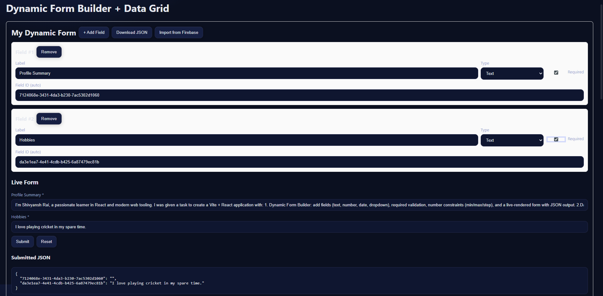
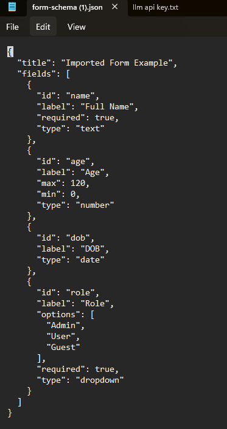
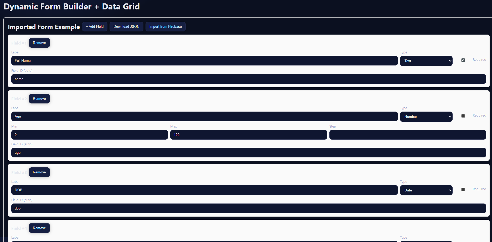
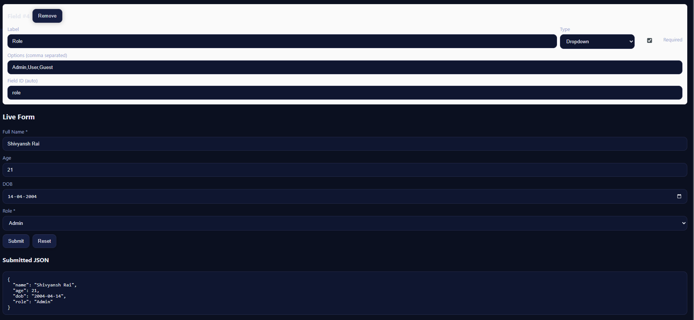
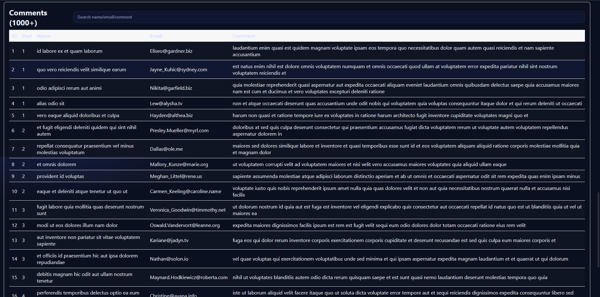
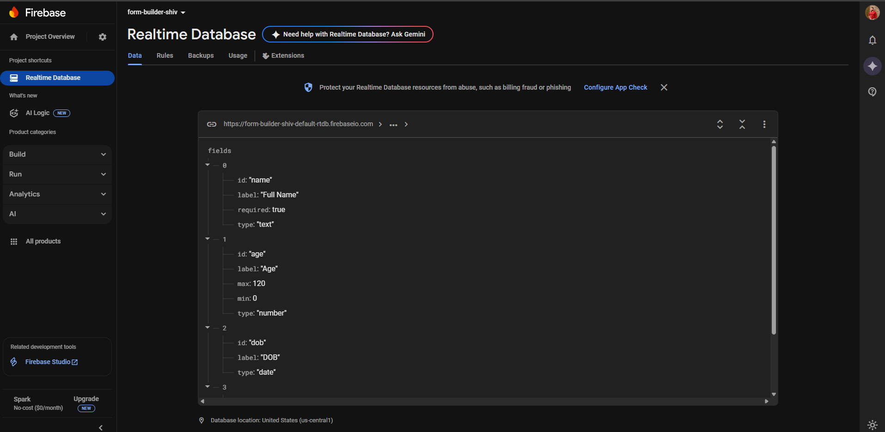

# React + Vite

Here this template provides a minimal setup to get React working in Vite with HMR and some ESLint rules.

Currently, two official plugins are available:

- [@vitejs/plugin-react](https://github.com/vitejs/vite-plugin-react/blob/main/packages/plugin-react) uses [Babel](https://babeljs.io/) for Fast Refresh
- [@vitejs/plugin-react-swc](https://github.com/vitejs/vite-plugin-react/blob/main/packages/plugin-react-swc) uses [SWC](https://swc.rs/) for Fast Refresh

# ⚡ Dynamic Form Builder + Data Grid (React + Vite)

This project was built as part of an assignment for the React.js role.  
It demonstrates a **Dynamic Form Builder** (with Firebase schema import/export) and a **Data Grid** with filtering, sorting, and pagination using **@tanstack/react-table**.

This project is a **React + Vite application** that demonstrates two advanced frontend features:

1. **Dynamic Form Builder**  
   - Add, edit, and remove form fields dynamically (Text, Number, Date, Dropdown).  
   - Mark fields as *required*.  
   - Supports **min, max, step** for number inputs.  
   - Export form schema as JSON.  
   - Import schema directly from **Firebase Realtime Database**.  
   - Live form rendering with validation and JSON preview of submitted data.  

2. **Data Grid with Filtering & Pagination** (using [TanStack Table])  
   - Fetches 1000+ records from [JSONPlaceholder API](https://jsonplaceholder.typicode.com/comments).  
   - Features:  
     ✅ Sorting  
     ✅ Global search (by name, email, or comment)  
     ✅ Pagination with configurable page size  
     ✅ Sticky headers + responsive table  

---

## 🚀 Tech Stack
- [React 19 + Vite](https://vitejs.dev/) (with SWC for fast builds)
- [TanStack React Table](https://tanstack.com/table) (for grid & filtering)
- Firebase Realtime Database (for schema import)
- Modern UI/UX with custom CSS (dark + light theme support)

---

## 📸 Screenshots
### Dynamic Form Builder



### Data Grid




### Firebase Import (Bonus)
Imported form schema directly from Firebase Realtime Database:


# Dynamic Form Builder + Data Grid

## 🚀 Live Demo
[Vercel Deployment](https://dynamic-form-grid-shivyansh.vercel.app/)

## 💻 GitHub Repository
[GitHub Repo](https://github.com/1299-2004/dynamic-form-grid-shivyansh.git)

## 🔗 Firebase Example Import
Paste the following URL into the **“Import from Firebase”** section of the form builder:

👉 [Firebase Schema JSON](https://form-builder-shiv-default-rtdb.firebaseio.com/form.json)

Sample schema:
```json
{
  "title": "Imported Form Example",
  "fields": [
    { "id": "name", "label": "Full Name", "type": "text", "required": true },
    { "id": "age", "label": "Age", "type": "number", "min": 0, "max": 120 },
    { "id": "dob", "label": "DOB", "type": "date" },
    { "id": "role", "label": "Role", "type": "dropdown", "options": ["Admin", "User", "Guest"], "required": true }
  ]
}


---

## 🛠️ Getting Started

Clone this repo and run locally:

```bash
git clone https://github.com/1299-2004/dynamic-form-grid-shivyansh.git
cd dynamic-form-grid-shivyansh
npm install
npm run dev

